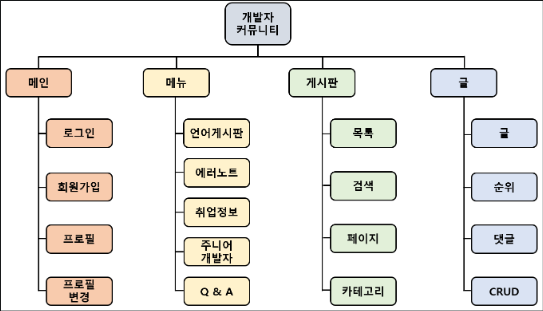
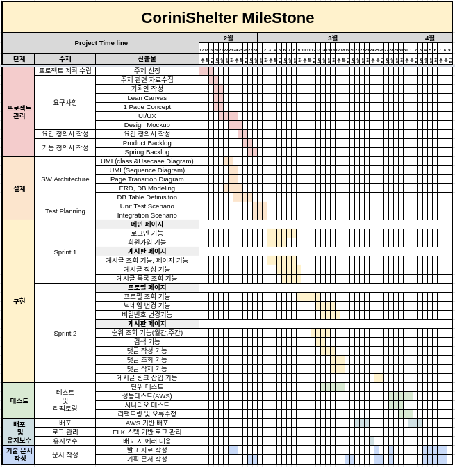
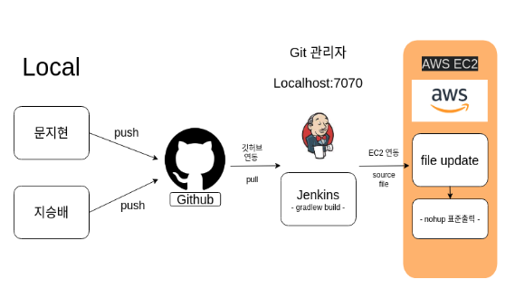

# 코린이 대피소 ( 개발자 커뮤니티 )

# 운영중 : [코린이 대피소](http://13.209.116.217:8080/main)

## 목차

[1.설명](#설명)<br>
[2.사용한 기술](#🔨사용한-기술)<br>
[3.팀원소개](#팀원소개)<br>
[4.운영구성](#운영구성)<br>
[5.비고](#비고)<br>
<!-- [4.주요 기능](#주요-기능)<br> -->
<!-- [5.단위 테스트 개발](#단위-테스트-개발)<br> -->
<!-- [6.성능 테스트](#성능-테스트)<br> -->


# 📋설명
개발자를 위한 커뮤니티는 기존에 존재하였지만, 언어나 프레임워크 기반의 단편화된 커뮤니티 위주이고, 개발자를 입문하는 이들에게 다양한 지식과 습관, 채용 정보를 제공하고, 기존의 커뮤니티를 연계해주는 주니어 개발자 특화형 개발자 커뮤니티를 구상하였습니다.
자바와 스프링을 보다 깊게 이해하기 위해 아래와 같은 기술을 통해서 자바 생태계를 이해하는 프로젝트였습니다.  
<br><br>

## 🔨사용한 기술 
- IDEA : ```IntelliJ Ultimate```
### Front-end
- Templete engine : ```Thymeleaf``` 
- Templete openSource ToolKit : ```Bootstrap 4 ```
- Markup language : ``` HTML, css ```
- Language : ``` javascript ```
### Back-end
- Language : ``` java 11.0.2 ```
- Web Application Server : ```Apache Tomcat 8.0```
- Framework : ```Spring Boot 2.4```,
 ```Spring Security```
- Build : ```Gradle 6.8 ```
- Test : ```JUnit 5```,```JMeter```
- ORM : ``` JPA ```
- ORM Module : ```Spring Data JPA```
- Database : ```MySQL 8.0.2 ```, ``` H2 DataBase```
### Devops
- AWS : ``` EC2```,``` RDS ```
- continuous Integration tool : ``` jenkins ```
- Team Collaboration Tool : ``` Google Drive```,``` Github```,``` Notion```,``` Gitbash ```

<br>

# 💡 팀원소개

|이름|깃허브|블로그|
|---|---|---|
|지승배|[JeeSeungBae](https://github.com/jeeseungbae) | [Tistory](https://jsb-diary0011.tistory.com/)
|문지현|[jihyeonmun](https://github.com/jihyeonmun) | [Tistory](https://startupdevelopers.tistory.com/)
<br>

# 운영구성

<!-- 
# WBS


# 마일스톤


# 배포
 -->

# 비고

[project - 기획](https://drive.google.com/file/d/1b3jvRCzNwwICqVGKlSWpNIjtKHfPafWy/view?usp=sharing)

[ 이슈 - 일정 정리 ](https://github.com/playdata-finalproject/teamproject_final/projects/1)
