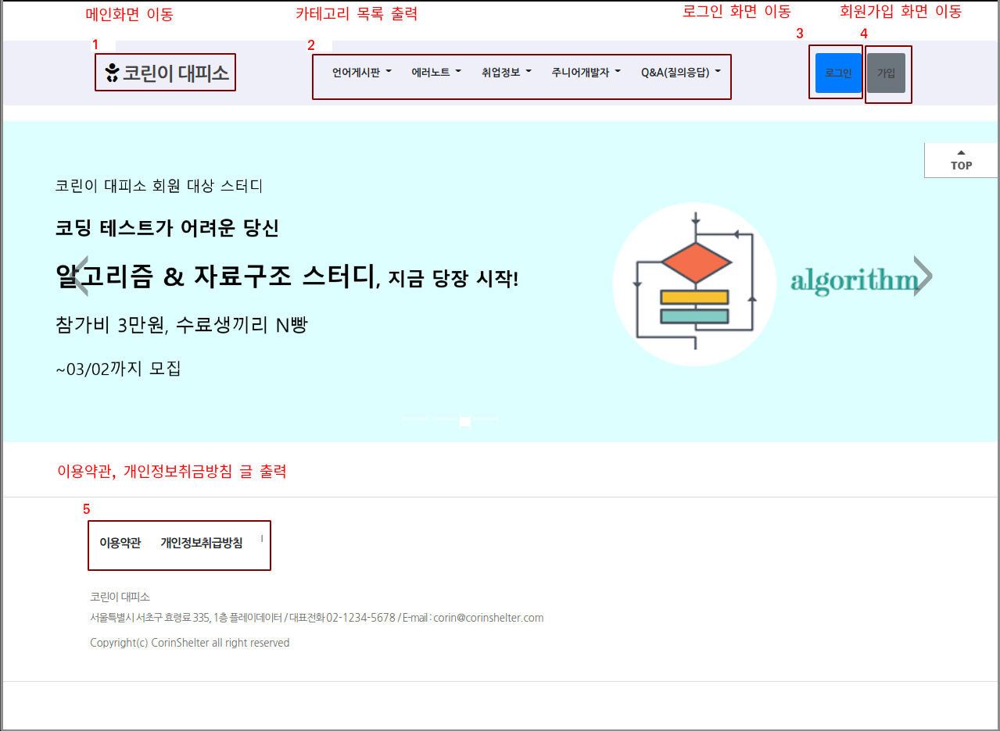
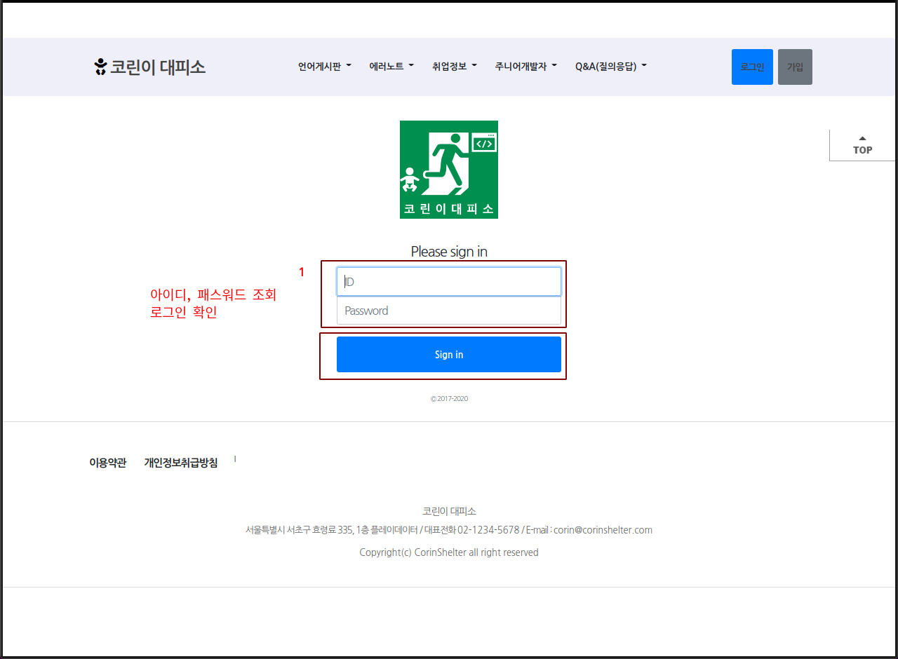
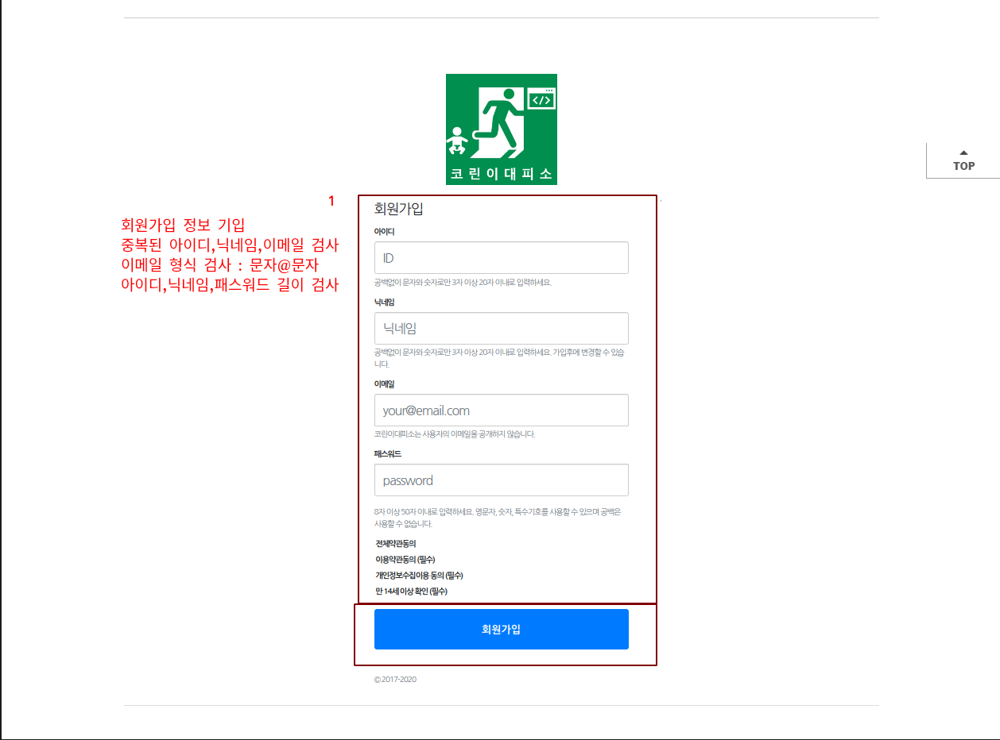
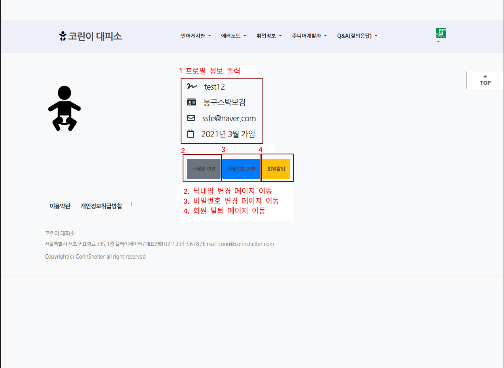
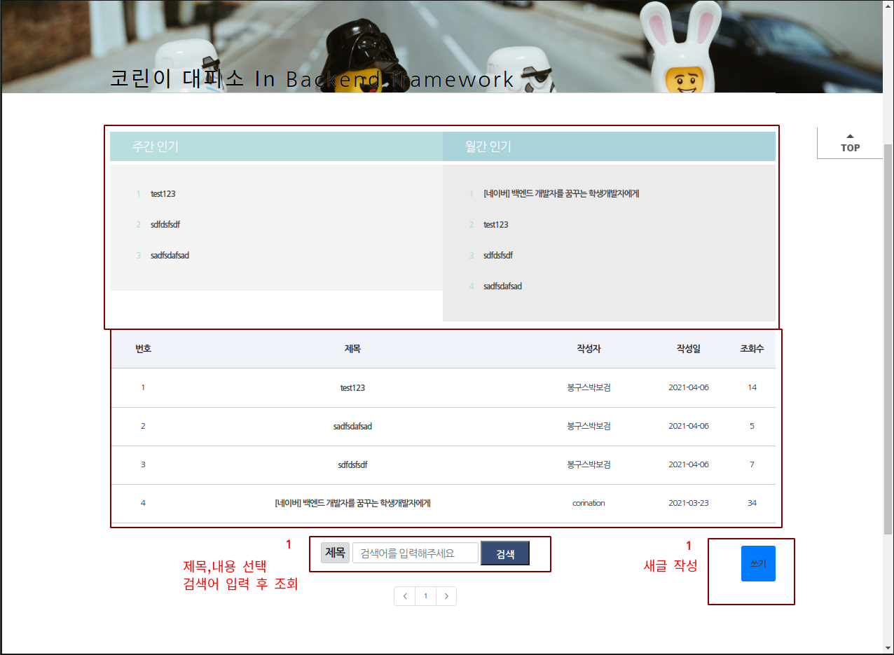
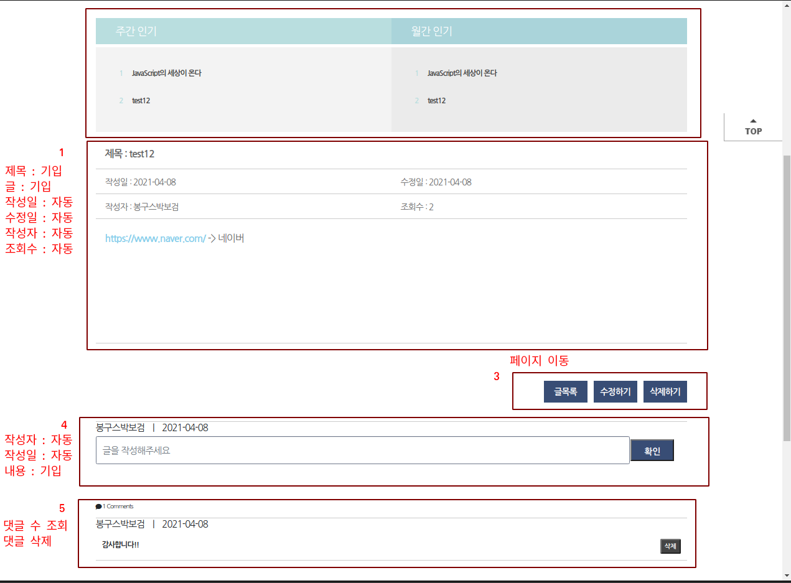

# 코린이 대피소 ( 개발자 커뮤니티 )

# 운영중 : [코린이 대피소](http://13.209.116.217:8080/main)

## 목차

[1.설명](#설명)<br>
[2.사용한 기술](#사용한-기술)<br>
[3.팀원소개](#팀원소개)<br>
[4.운영구성](#운영구성)<br>
[5.프로젝트 기능설명](#프로젝트-기능설명)<br>
[6.프로젝트 사용법](#프로젝트-사용법)<br>
[7.비고](#비고)<br>
<!-- [4.주요 기능](#주요-기능)<br> -->
<!-- [5.단위 테스트 개발](#단위-테스트-개발)<br> -->
<!-- [6.성능 테스트](#성능-테스트)<br> -->


# 📋설명
개발자를 위한 커뮤니티는 기존에 존재하였지만, 언어나 프레임워크 기반의 단편화된 커뮤니티 위주이고, 개발자를 입문하는 이들에게 다양한 지식과 습관, 채용 정보를 제공하고, 기존의 커뮤니티를 연계해주는 주니어 개발자 특화형 개발자 커뮤니티를 구상하였습니다.
자바와 스프링을 보다 깊게 이해하기 위해 아래와 같은 기술을 통해서 자바 생태계를 이해하는 프로젝트였습니다.  
<br><br>

## 🔨사용한 기술 
- IDEA : ```IntelliJ Ultimate```
### Front-end
- Templete engine : ```Thymeleaf``` 
- Templete openSource ToolKit : ```Bootstrap 4 ```
- Markup language : ``` HTML, css ```
- Language : ``` javascript ```
### Back-end
- Language : ``` java 11.0.2 ```
- Web Application Server : ```Apache Tomcat 8.0```
- Framework : ```Spring Boot 2.4```,
 ```Spring Security```
- Build : ```Gradle 6.8 ```
- Test : ```JUnit 5```,```JMeter```
- ORM : ``` JPA ```
- ORM Module : ```Spring Data JPA```
- Database : ```MySQL 8.0.2 ```, ``` H2 DataBase```
### Devops
- AWS : ``` EC2```,``` RDS ```
- continuous Integration tool : ``` jenkins ```
- Team Collaboration Tool : ``` Google Drive```,``` Github```,``` Notion```,``` Gitbash ```

<br>

# 💡팀원소개

|이름|깃허브|블로그|
|---|---|---|
|지승배|[JeeSeungBae](https://github.com/jeeseungbae) | [Tistory](https://jsb-diary0011.tistory.com/)
|문지현|[jihyeonmun](https://github.com/jihyeonmun) | [Tistory](https://startupdevelopers.tistory.com/)
<br>

# 운영구성

<br><br>

# 🕵🏻‍♂️프로젝트 기능설명

|구분|요청사항|설명|
|---|---|---|
|메인|메뉴 화면|-Security적용-<br>모든 사용자 main 페이지 접근허용<br> 다른페이지 로그인 시 접근 허용|
|메인|로그인|ID,PW 데이터 조회 후 로그인|
|메인|회원 가입|공백 및 지정된 문자 만 허용 <br> ID, 닉네임, 이메일 중복체크|
|메인|프로필|프로필 조회<br>닉네임변경(중복체크)<br> 비밀번호 변경|
|게시판|카테고리|카테고리 정보 조회 - RestAPI(GET)|
|게시판|목록|월간,주간 인기순 확인<br>조회수 확인<br>제목 및 내용 정보 조회|
|게시판|글|월간,주간 인기순 확인<br>공백 체크<br>정규표현식 이용(http,https) -> url 변환<br>Html 태그 삭제<br>카테고리,작성자 자동 입력<br>모든 이용자 글목록 추가<br>작성자 == 회원정보 수정,삭제 버튼 추가<br>수정시 글 작성 유지|
|게시판|댓글|공백체크<br>작성자,날짜 자동입력<br> 작성자 == 회원정보 삭제버튼 추가|
<br>

# 👩🏻‍💻프로젝트 사용법






<br><br>

# 비고

[project - 기획](https://drive.google.com/file/d/1b3jvRCzNwwICqVGKlSWpNIjtKHfPafWy/view?usp=sharing)

[ 이슈 - 일정 정리 ](https://github.com/playdata-finalproject/teamproject_final/projects/1)
